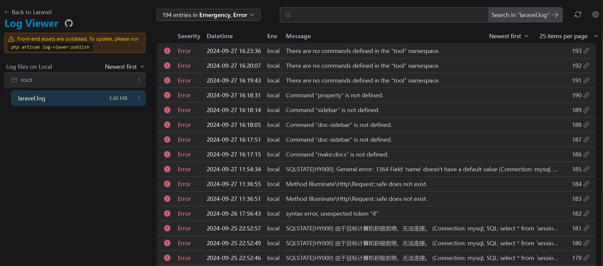
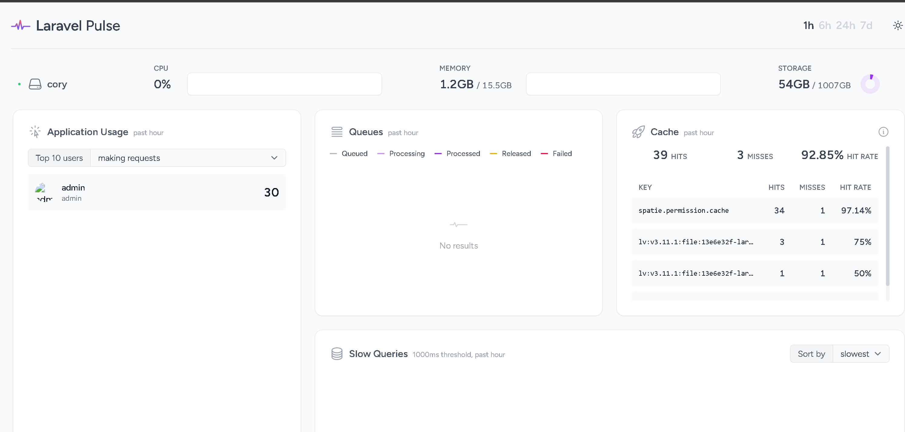
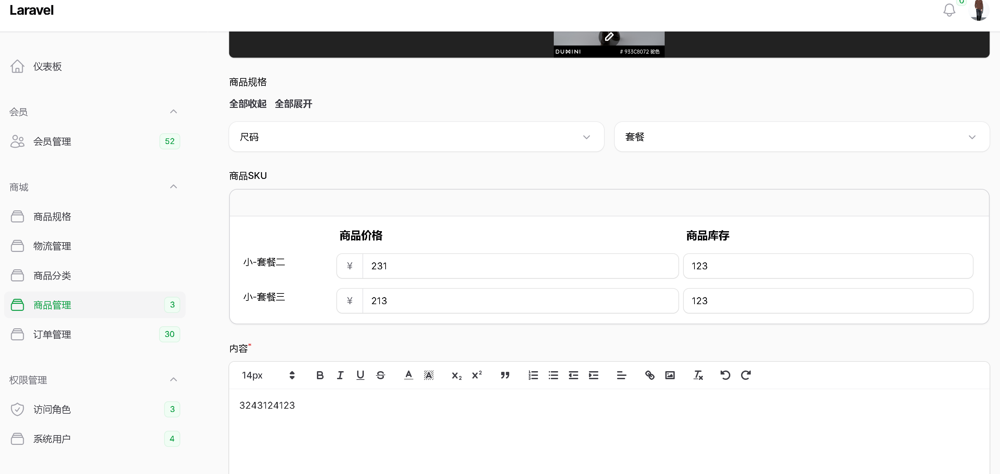
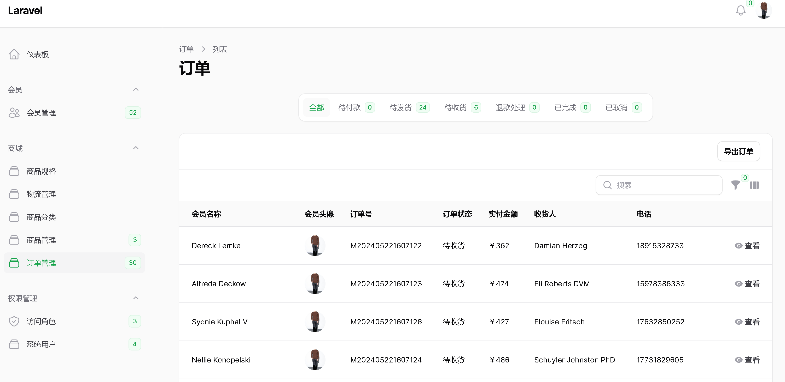
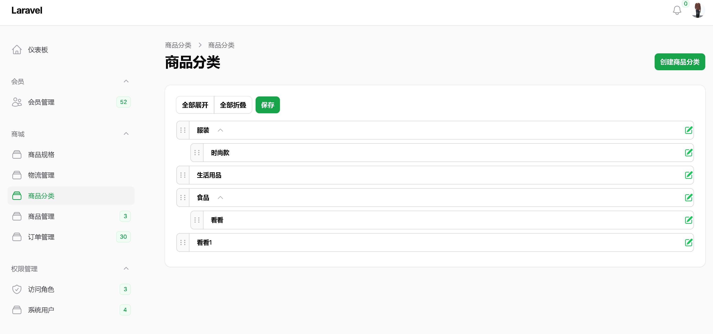
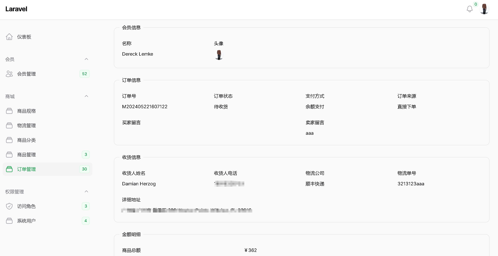

# Filament 后台脚手架 内置商城模块

## 配置指南

```bash
# 安装包管理
composer install
# 创建软连接
php artisan storage:link
# 创建配置文件并配置好数据库信息
cp .env.example .env
# 生成APP_KEY
php artisan key:generate
# 执行迁移
php artisan migrate
# 生成超级管理员账号,由于是手机号登录的，还需要手动去users表设置下phone字段
php artisan make:filament-user
# 配置权限,并将刚刚生成的账号设置为超级管理员
php artisan shield:generate --all
php artisan shield:super-admin --user=1
# 生成模拟数据（可选）
php artisan db:seed --class=UserSeeder # 生成会员数据以及积分余额记录
```

## 七牛云对象存储配置

```bash
# 安装网址：
https://github.com/overtrue/laravel-filesystem-qiniu
# 安装完毕后在env文件配置即可
FILAMENT_FILESYSTEM_DISK=qiniu
```

## 日志查询系统配置
```bash
# 发布前端文件
php artisan log-viewer:publish
# 必须登录users表ID=1的账户，才能查看日志，否则会报权限问题
访问地址 {APP_URL}/log-viewer
```



## 性能监控
```bash
# 使用文档：https://laravel.com/docs/11.x/pulse
# 服务器记录器，需要长期异步执行：php artisan pulse:check
# 必须登录users表ID=1的账户，才能查看
访问地址 {APP_URL}/pulse
```



## 常用方法
```bash
# 省市区级联：直接在资源中的form方法里面的schema，添加如下代码即可
FilamentService::getFormArea()
# 自动生成模型注释
php artisan property
```

## 接口文档

```bash
使用说明：https://docsify.js.org/#/zh-cn/quickstart
访问地址：{APP_URL}/docs
文档目录：/docs 的文件夹下面便是，如需要排序的话在文件或者目录前缀加上序号即可
# 执行如下代码，自动根据文档目录覆盖 _sidebar.md 侧边栏
php artisan docs
```


## 使用到的包
```bash
filament后台权限管理： https://github.com/bezhanSalleh/filament-shield
filament实现tree列表：https://github.com/solutionforest/filament-tree
filament实现select组件渲染tree节点：https://github.com/codewithdennis/filament-select-tree
filament实现表格布局的中继器组件：https://github.com/icetalker/filament-table-repeater
filament富文本编辑器：https://github.com/rawilk/filament-quill
filament实现点击图片展示大图的功能：https://github.com/hugomyb/filament-media-action
filament全局搜索模态插件：https://github.com/CharrafiMed/global-search-modal
API规范响应数据格式：https://github.com/jiannei/laravel-response
Laravel的日志查看器：https://github.com/opcodesio/log-viewer
Laravel的性能监控：https://github.com/laravel/pulse
微信SDK：https://github.com/overtrue/laravel-wechat
Laravel快速构建查询：https://github.com/spatie/laravel-query-builder
Laravel实现注册路由：https://github.com/spatie/laravel-route-attributes
Laravel 图表数据生成工具：https://github.com/Flowframe/laravel-trend
```


## 项目截图







